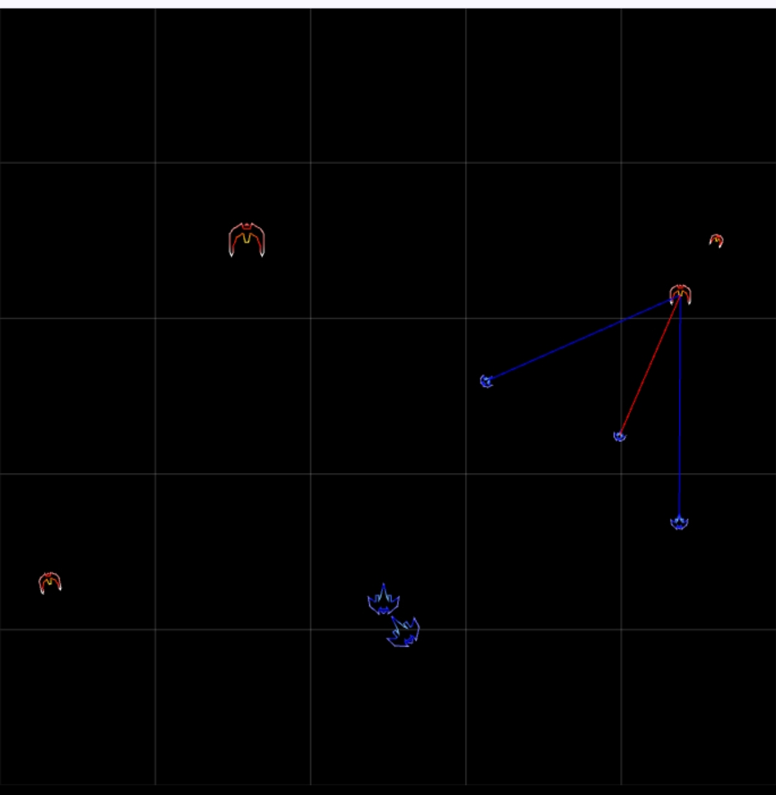

<h1><a href="https://bacionejs.github.io/byte-armada/" style="text-decoration: none; color: inherit;">Play</a></h1>

# 📜 **Byte Armada Instructions**

**Byte Armada** is a real-time strategy space shooter. 

---

Two modes:  
- 🤖 Single Player  
- 🧍 Player versus Player (1v1) 

For 1v1, just long-press the intro screen and scan 🔗 each other's phone 📱, but it only works with Android Chrome on the same wifi. 

---

🥅 Objective: get a ship to the other side.

---

🚀 To create a ship, **click two** of the five zones:

- Your **first click** determines the ship’s horizontal **position** and **speed**
- Your **second click** determines the **range**
- For example, to create a fast ship in the lower-right, click upper-right.

> With 5 zones for 🎚️ speed and 🎚️ range, there are **25 possible ship configurations**.

🛡 Ships with **higher speed have less HP**,  
🔫 Lasers with **longer range are weaker**.

---

# 📘 Post-Mortem

---

## 🎮 Gameplay Design

**Byte Armada** is a real-time strategy space shooter.

My inspiration for the game is the classic *Age of Empires*, where you have to manage resources and choose different unit types. 

I wanted to distill down to the essence of the genre — the balancing act between agility and strength, hit power and firepower — and make it with a simple interface.

Actually, it is a real-time tactics (RTT) game, not RTS, but few are familiar with that term. Unlike RTS, RTT doesn't include base building.

You're limited to *five units at a time*. Whereas the enemy has no limit and spawns faster each level.

To increase user interest, levels can be skipped.

To reduce UI clutter, instead of ugly health bars over each unit, ship size indicates HP and TTS tells status.

To reduce interactions, there is no route swiping, and position/speed are combined in the first click - unorthodox and non-intuitive, but it does help in a fast-paced game.

To reduce UI complexity, instead of choosing distinct units with various abilities, you have *two traits*, which, when combined with *five magnitudes*, provide *25 combinations*, with inverse relationships, hoping that complex strategies *might* emerge. **But in the end, nothing tactically interesting emerges, in fact, PvP is a constant stalemate**.

---

## 🎨 Art

I created [Vector Bay](//github.com/bacionejs/vectorbay) for building symmetrical ships.

---

## 📷 Barcode Handshake

I wanted the option to have 1v1 and spent an incredible amount of time figuring out ways to do the **communication handshake between two phones without requiring a server**.

At one point, I used Messenger for the handshake and supported remote 1v1 via STUN, but it was cumbersome and non-compliant.

I settled on **barcodes** because it's the only handshake strategy that fits within the JS13K rules — although it **only works on Android Chrome**.

Since it is a face-to-face handshake, I dropped remote STUN support, and now both peers must be on the same Wi-Fi.

JavaScript has a built-in barcode *reader*, but not a *generator*. For the generator, I originally considered `QR Code`, but even with a fixed version and error level, the logic is still 10k. This is due to **complex features** like multiple placement patterns, *masking with scoring and selection*, and *interleaving data across multiple blocks* with separate error correction.

`DataMatrix` has a much simpler structure: fixed placement, no masking, and a single block, and I simplified the algorithm to 1k, mostly by supporting only a single encoding mode.

It supports a 2,000 byte payload, but anything above 200 is unreliable — **not because of the barcode generator or the `BarcodeDetector` API, but because my live camera pipeline is fragile and lacks the advanced image processing built into native phone scanners**.

RTC handshakes (SDP) are 1,600 bytes, and compression only brings that down to 700. So I implemented **SDP elision**, stripping out shared boilerplate, reducing the payload to just 130. 🎉

